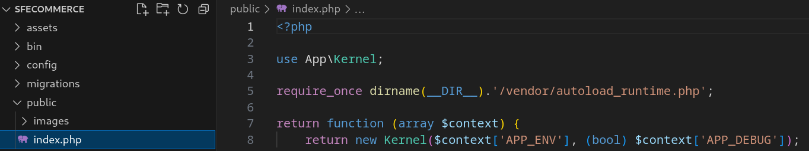
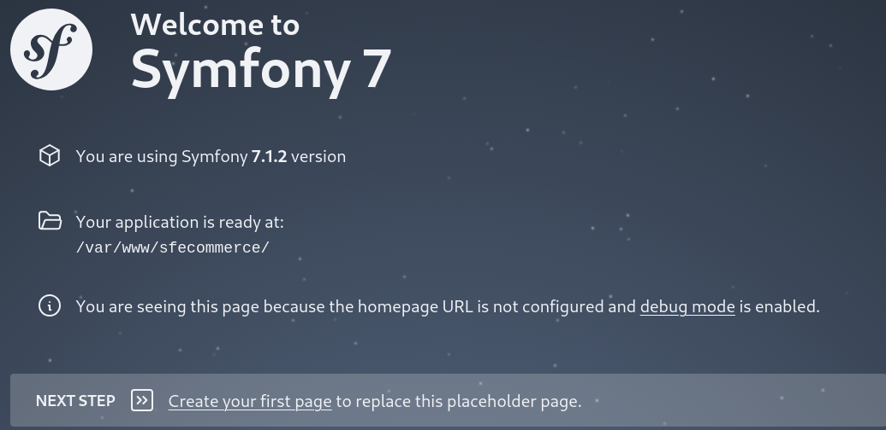
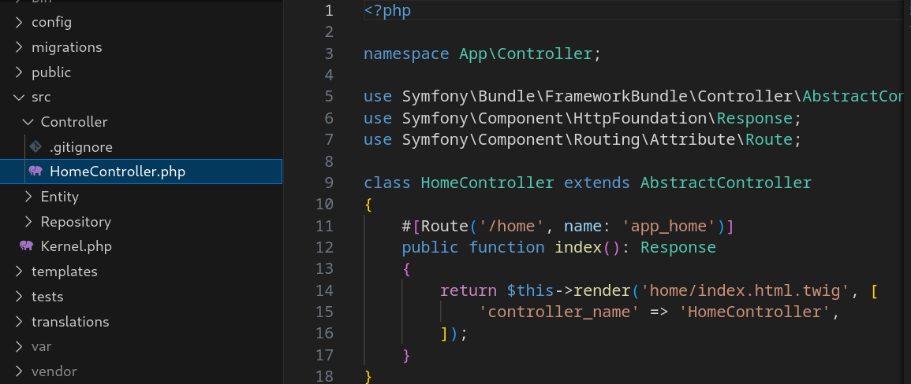
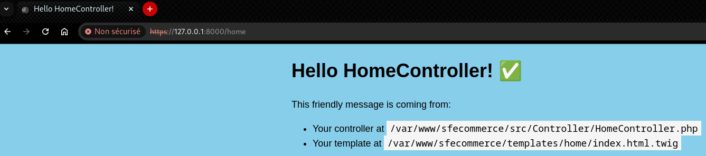

# Site E-commerce
## Environnement de travail
- Debian12
- Symfony7
- Syfony CLI
- Symfony CLI
- PHP 8.2
- Composer 2.7
- Framework Bootstrap

  ## Installation de Symfony7
  Avant d'installer Symfony7 j'utilise un outil de Symfony pour vérifier mon système s'il répond à toutes les exigences.
    
  *__Je lance la commande__* :
  ```
  symfony check:requirements
  ```
  
  
Je peux maintenant installer Symfony7, pour le faire je suis la documentation d'installation de Symfony.
[Documentation](https://symfony.com/doc/current/setup.html)

On a plusieurs façons de créer le projet Symfony7 le plus simple pour moi c'est avec composer.  

*__Je lance la commande__* :
```
composer create-project symfony/skeleton:"7.1.*" sfecommerce
cd sfecommerce
composer require webapp
```
Mon projet sfecommerce est créé.



Je vais maintenant afficher la page de bienvenue de Symfony7, pour faire cela je lance la commande "symfony server:start".



La page de Bienvenue de Symfony7 est affichée, je voulais maintenant créer ma page d'accueil de mon site, j'utilise maker-bundle pour créer le contrôleur associé à ma page.

```
php bin/console make:controller HomeController

```


une fois que la page home est créée j'actualise la page.




